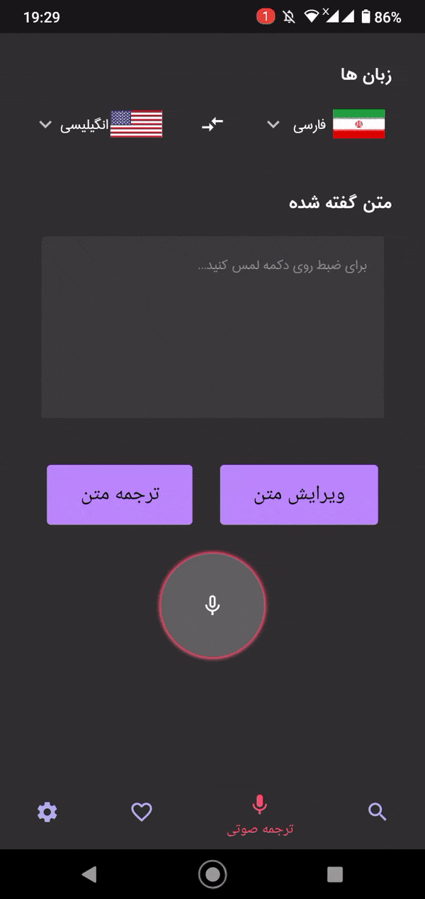
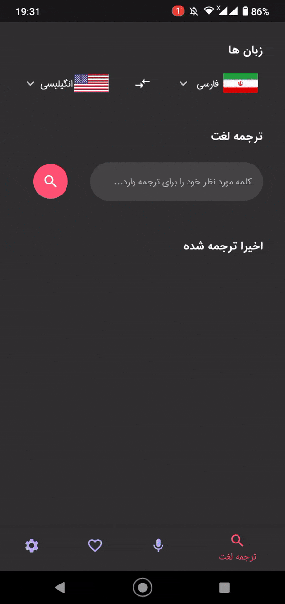
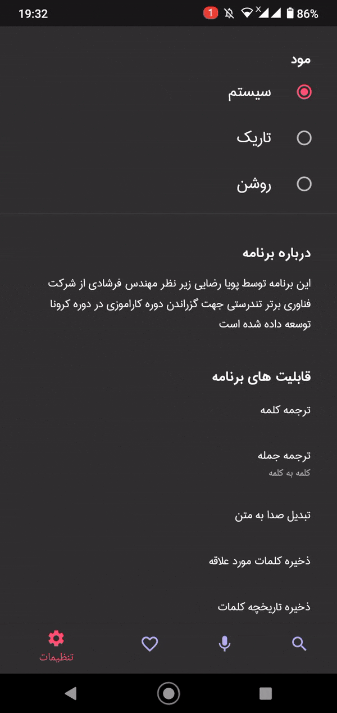
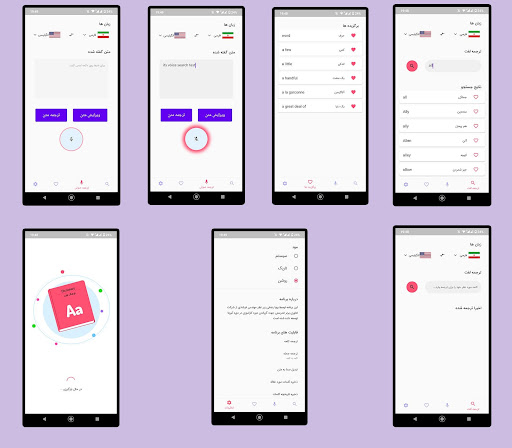
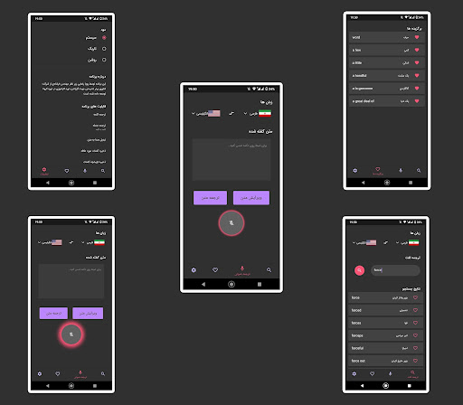

# fa_dict

This Application is written for internships course.

# about

This Application is a multilingual dictionary program based on open source databases that is currently implemented for both Persian and English languages.

This Application written with flutter framework and used bloc state management tools.

# features

1. Word-for-word translation using the database
2. Live Search
3. Multi theme(store the theme selected by the user)
4. Speech to text

# views

  
   
  

